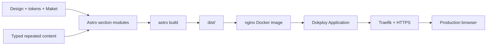

# Astro Landing and Dokploy Design Specification

**Status:** Approved on 2026-07-10

## Goal

Перенести утверждённый лендинг школы «Ресурс» из `Maket.html` в поддерживаемую Astro-архитектуру, сохранить дизайн-систему и маркетинговый текст, добавить проверяемое motion/accessibility поведение и подготовить воспроизводимый deployment на собственный VPS через Dokploy.

## Authoritative Sources

| Concern | Source | Rule |
|---|---|---|
| Visual intent, tone, typography, component rules | `Design.md` | Определяет зачем и где применяется стиль |
| Exact token values and W3C representation | `design-tokens.json` | Определяет значения цветов, spacing, radii, shadows, layout и motion |
| Runtime CSS variables and utility contracts | `tokens.css` | Импортируется приложением; raw values в Astro modules не дублируются |
| Marketing copy, section order, form fields, inline SVG | `Maket.html` | Текст переносится без редакторских изменений |
| Astro/Tailwind/GSAP conventions | `GUIDE.md`, `AGENTS.md` | Определяют module layout, motion constraints и QA gates |

При конфликте значения токена берутся из `design-tokens.json`; runtime variable name — из `tokens.css`; назначение — из `Design.md`. Несоответствие исправляется в source-файлах, а не локальным override внутри section module.

## Scope

### Included

- Полная landing page на Astro 6.
- Tailwind CSS v4 и существующие CSS variables.
- Секционная module decomposition.
- Перенос всех текстов, списков, gifts, stats и inline SVG из `Maket.html`.
- Централизованные GSAP/ScrollTrigger animations.
- Responsive layouts на mobile и desktop.
- Registration UI без production submission.
- SEO metadata, OpenGraph, favicon и legal link contract.
- Automated structural checks, Astro check/build и Playwright browser checks.
- Static Docker/nginx image и Dokploy deployment procedure.

### Excluded

- Изменение marketing copy.
- Новый visual direction.
- CMS, database, authentication или user accounts.
- Production registration receiver, CRM, GetCourse, n8n или backend adapter.
- SSR/Node runtime в production.
- React, Vue или client-side router.

## Architecture



`src/pages/index.astro` остаётся composition root: только imports и утверждённый порядок sections. `src/layouts/Layout.astro` — глубокий module: владеет document shell, metadata, fonts, global stylesheet import и единственным motion bootstrap. Section modules владеют своей семантической разметкой и layout, но не создают собственные global scripts.

## File Map

### Create

```text
src/
  components/
    ui/
      Button.astro
      Card.astro
      SectionLabel.astro
    Hero.astro
    Hook.astro
    Audience.astro
    DualValue.astro
    Program.astro
    CareerPath.astro
    Stats.astro
    Speaker.astro
    Bonuses.astro
    Registration.astro
    Footer.astro
    StickyCTA.astro
  content/
    landing.ts
  layouts/
    Layout.astro
  lib/
    motion.ts
    registration.ts
  pages/
    index.astro
  styles/
    global.css
public/
  favicon.svg
  og-image.svg
  robots.txt
scripts/
  validate-content.mjs
tests/
  landing.spec.ts
Dockerfile
.dockerignore
nginx.conf
playwright.config.ts
```

### Modify

```text
package.json
package-lock.json
astro.config.mjs
AGENTS.md
Design.md
```

`Design.md` меняется только в разделе подключения runtime styles. `Maket.html` не входит в change set: он остаётся byte-stable reference и после миграции не участвует в build.

## Module Interfaces

### `Layout.astro`

```ts
interface Props {
  title: string;
  description: string;
  canonicalUrl?: URL;
  image?: string;
}
```

Invariants:
- `<html lang="ru">`.
- Один `<meta name="viewport">` с `viewport-fit=cover`.
- Default OpenGraph image `/og-image.svg`.
- Global CSS импортируется один раз.
- Motion bootstrap вызывается один раз после DOM readiness.

### `Button.astro`

```ts
interface Props {
  href?: string;
  type?: 'button' | 'submit';
  variant?: 'cta' | 'secondary' | 'ghost';
  fullWidth?: boolean;
  disabled?: boolean;
  class?: string;
}
```

С `href` module рендерит `<a>`, без `href` — `<button>`. Disabled state запрещает interaction и остаётся визуально/семантически различимым.

### `Card.astro`

```ts
interface Props {
  as?: 'article' | 'div' | 'li';
  tone?: 'default' | 'blush' | 'sky' | 'gradient' | 'dark';
  interactive?: boolean;
  class?: string;
}
```

Module владеет border, radius, shadow, tone и допустимым hover lift. Content semantics выбираются через `as`; module не знает marketing content.

### `SectionLabel.astro`

```ts
interface Props {
  tone?: 'default' | 'inverse';
}
```

Module задаёт eyebrow typography и contrast; content передаётся default slot.

### `registration.ts`

```ts
export interface RegistrationPayload {
  name: string;
  email: string;
  messenger: string;
}

export type RegistrationResult =
  | { ok: true }
  | { ok: false; reason: 'not-configured' };

export function submitRegistration(
  _payload: RegistrationPayload,
): RegistrationResult {
  return { ok: false, reason: 'not-configured' };
}
```

Это future integration seam. Adapter не создаётся, пока не выбран receiver. Interface не делает network request и не сохраняет personal data.

## Content Model

`src/content/landing.ts` содержит только повторяющиеся структуры:

```ts
export interface ProgramDay {
  day: 1 | 2 | 3;
  date: string;
  title: string;
  hook: string;
  points: readonly string[];
  giftTitle: string;
  giftDescription: string;
  tone: 'blush' | 'sky' | 'mixed';
}

export interface Bonus {
  title: string;
  description: string;
  tag: string;
  icon: 'test' | 'roadmap' | 'niches' | 'video';
}

export interface Stat {
  value: string;
  label: string;
}

export interface CareerStep {
  title: string;
  description: string;
}

export interface RegistrationGift {
  timing: 'сразу' | 'день 1' | 'день 2' | 'день 3';
  text: string;
}
```

Hero copy, speaker biography и одноразовые paragraphs остаются рядом с соответствующей section разметкой. Generic section schema и universal renderer не создаются.

## Required Section Order

1. `Hero`
2. `Hook`
3. `Audience`
4. `DualValue`
5. `Program`
6. `CareerPath`
7. `Stats`
8. `Speaker`
9. `Bonuses`
10. `Registration`
11. `Footer`
12. `StickyCTA`

CTA links используют один anchor contract: `href="#registration"`; registration section использует `id="registration"`.

## Styling and Tokens

`src/styles/global.css` импортирует Tailwind и root `tokens.css`:

```css
@import "tailwindcss";
@import "../../tokens.css";

@theme inline {
  --color-brand-sky: var(--color-sky);
  --color-brand-blush: var(--color-blush);
  --color-brand-rose: var(--color-rose);
  --color-brand-cta: var(--color-cta);
  --color-brand-text: var(--color-text);
  --font-brand-heading: var(--font-heading);
  --font-brand-body: var(--font-body);
}
```

Правила:
- Raw hex запрещён в `src/`, кроме inline SVG artwork, перенесённого из `Maket.html`.
- Spacing, radius, shadow, duration и easing используют variables.
- `transition: all` в `tokens.css` заменяется перечислением `transform, box-shadow, background-color, color, border-color, opacity`.
- Breakpoint layout contract остаётся `700px`; typography использует `clamp()`.
- Montserrat используется для headings/metrics; Inter — для body/UI.

## Motion

`src/lib/motion.ts` экспортирует одну функцию:

```ts
export function initLandingMotion(): () => void;
```

Она регистрирует ScrollTrigger, устанавливает initial states и возвращает cleanup function. Поддерживаемые declarative hooks:

```text
[data-animate="reveal"]
[data-animate="slide-left"]
[data-animate="slide-right"]
[data-animate="scale"]
[data-animate-group]
```

Constraints:
- Каждому `gsap.to()` предшествует `gsap.set()`.
- Scroll reveals используют `once: true`.
- Анимируются только `transform`, `opacity` и SVG stroke properties.
- При `prefers-reduced-motion: reduce` initial hidden states не применяются.
- Continuous decorative loops реализуются CSS keyframes, не GSAP.
- Cleanup вызывается при `astro:before-swap`, даже если transitions позже не используются.

## Registration Behavior

Form fields: `name`, `email`, `messenger`; native HTML constraints сохраняются. Submit sequence:

1. Browser validation блокирует invalid values.
2. Valid values собираются в `RegistrationPayload`.
3. `submitRegistration()` возвращает `not-configured`.
4. Inline live region показывает: «Форма пока не подключена. Данные не отправлены.»
5. Input values не логируются, не отправляются и не сохраняются.

Button не показывает success wording. Form не содержит fake timeout, alert или mock network response.

## SEO, Accessibility, and Performance

### SEO

- Unique title and description from current landing intent.
- Canonical URL добавляется только после предоставления production domain.
- OpenGraph type/title/description/image.
- `robots.txt` разрешает indexing только после production-domain gate.
- Policy link не использует `href="#"`; до готовой policy page это plain text или disabled link.

### Accessibility

- Один `h1`; section headings следуют `h2`/`h3` hierarchy.
- Visible focus state для links, buttons и inputs.
- Decorative SVG: `aria-hidden="true"`; meaningful art получает text alternative.
- Form labels связаны через `for`/`id`; status использует `role="status"` и `aria-live="polite"`.
- Contrast проверяется для text, muted text, CTA и dark form section.
- Sticky CTA не перекрывает focus target; учитывается safe-area inset.

### Performance

- Raster images проходят через `astro:assets` с explicit dimensions.
- Hero image загружается eager; остальные lazy.
- Fonts preconnect; production может перейти на self-hosted WOFF2 отдельным решением.
- No client framework runtime.
- Release budgets: Lighthouse Performance >= 90, Accessibility >= 95, CLS <= 0.1, LCP <= 2.5s на mobile profile.

## Verification Strategy

Add development dependencies:

```text
@astrojs/check
typescript
@playwright/test
```

Add scripts:

```json
{
  "check": "astro check",
  "test:e2e": "playwright test",
  "verify": "npm run check && npm run build && npm run test:e2e"
}
```

`scripts/validate-content.mjs` verifies exact counts and immutable markers: 3 program days, 4 instant bonuses, 3 stats, registration fields, required section IDs. `tests/landing.spec.ts` verifies section order, CTA anchors, form no-send status, keyboard focus, reduced-motion visibility and mobile/desktop layouts.

## Container and Dokploy Design

### Docker image

- Builder: `node:22-alpine`.
- Install: `npm ci`.
- Build: `npm run build`.
- Runtime: pinned `nginx:alpine` digest during implementation.
- Copy only `dist/` and `nginx.conf`.
- Run nginx on container port `80`.
- Health endpoint: `/healthz` returns `200` without filesystem dependency.
- Docker `HEALTHCHECK` uses BusyBox `wget` against `http://127.0.0.1/healthz`.

### nginx

- `try_files $uri $uri/ =404`; no SPA fallback.
- `index.html`: `Cache-Control: no-cache`.
- `/assets` and `/_astro`: one-year immutable cache.
- gzip for HTML, CSS, JavaScript, SVG and JSON.
- Security headers: `X-Content-Type-Options`, `Referrer-Policy`, `Permissions-Policy`, frame restriction.

### Dokploy

- Resource type: Application.
- Source: Git repository and production branch.
- Build type: Dockerfile; context `.`; file `Dockerfile`.
- Domain container port: `80`.
- Do not publish Advanced host ports for normal web traffic; Traefik routes internally.
- DNS A/AAAA records resolve to VPS before enabling HTTPS.
- Enable HTTPS/Let's Encrypt in Domains.
- Health check command/path targets `/healthz`.
- VPS firewall permits inbound 80/443; application container port remains internal.

### Deployment and rollback gates

1. Local `npm run verify` passes.
2. Local Docker image builds.
3. Local container returns 200 for `/` and `/healthz`.
4. Dokploy deploy becomes healthy.
5. Temporary Dokploy domain passes smoke checks.
6. Production DNS resolves to VPS.
7. HTTPS certificate is valid.
8. Production page passes section/form checks.
9. On failure, redeploy the previous successful Dokploy deployment/image; do not patch the running container.

## Acceptance Criteria

- Page contains every approved section in approved order.
- Marketing copy matches `Maket.html` exactly except semantic whitespace.
- Runtime design values resolve through existing tokens.
- No section-level GSAP script exists.
- Form never sends or stores data and states this inline.
- Astro check, build, content validation and Playwright pass.
- Docker container serves static output and reports healthy.
- Dokploy routes the domain through HTTPS to container port 80.
- `Maket.html` remains an unchanged migration reference.
